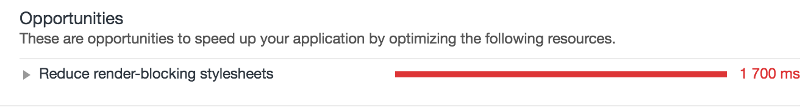

# Semantic.UI & React

Semantic-UI-React is a great choice, almost a great choice.

> SUI = Semantic.UI        
SUIR = Semantic-UI-React

### No SUIR?
You can always select another framework - [my article with comparison of best React UI frameworks.](https://hackernoon.com/the-coolest-react-ui-frameworks-for-your-new-react-app-ad699fffd651)    
If you still don't want to use SUIR, just remove it from the boilerplate. The boilerplate is great even without Semantic.

## SUIR

### Good parts:
##### 1. Big UI library:
There are many great components that are ready to use. It's probably the biggest and most full-featured React UI framework.
##### 2. Based on SUI:
When you use SUIR you import all SUI styles. So you can use the power of SUI that already has a very big community, many components/utils/plugins/etc.

### Bad parts:
There are few issues (or it'd be better to say "notes") using SUIR:

##### 1. SUIR use CSS styles:
SUIR is build based on [`classnames`](https://github.com/JedWatson/classnames) and CSS styles from SUI. According to the latest [issues and proposals](https://github.com/Semantic-Org/Semantic-UI-React/issues/1009) in SUIR repo, SUIR will migrate to an inline-styles library like `radium`, `styled-components`, `glamour`.

The main problems of using SUI CSS styles:
  1. SSR can't render all the things.
  2. Import of unused styles. Using a library like `styled-components` we import only styles that are used.
  > You can try to use PurifyCss to remove unused CSS. But probably it doesn't help because PurifyCss determinate unused styles based only on static markup.

  3. SUI styles are huge and block rendering.
  
  > There is a trick for this: you can split SUI styles into 2 smaller chunks that would be downloaded faster if you use HTTP2.

#### 2. Lodash is a dependency of SUIR:
Lodash is great, but probably it isn't always needed in small projects. But almost every middle/big size project uses Lodash, so it's just a note.

### Summary
SUIR is great, but it still lacks inline-styles. If this feature would be added soon then SUIR probably will be the best React framework.
> Every contribution into [SUIR](https://react.semantic-ui.com/introduction) is highly appreciated :)
